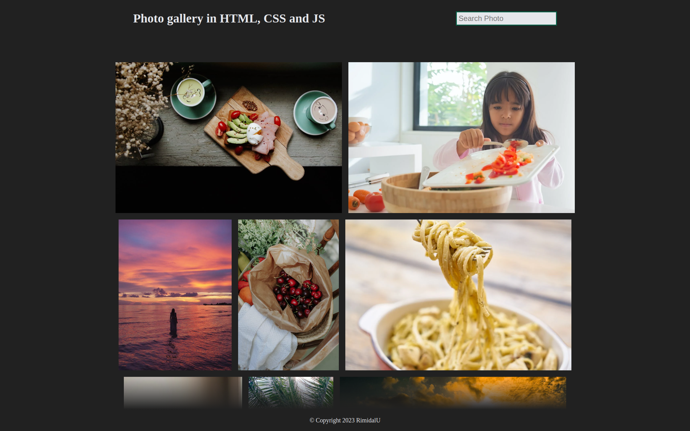

#  Photo gallery.

> Simple photo gallery in HTML, CSS and JavaScript.

---

[Description](#description) •
[Project setup](#project-setup) •
[Features](#features) •
[How To Use](#how-to-use) •
[Project Status](#project-status) •
[Room for Improvement](#room-for-improvement) •
[License](#license) •
[Contact](#contact)

## Description

A simple photo gallery with information about the photo, search by name and a random sequence of filling the gallery with photos.

## Project setup

- Clone this repo to your desktop.
- Run index.html in browser.
- Enjoy.

## Features
- Search by name.
- Generating a random position of photos in the gallery.
- Full screen photo on click.
- Information about photos on hover.

## How To Use

Run [Live Demo](https://simple-photogallery.netlify.app/)

1. Start index.html
2. Find the desired photo by name.
3. Learn more about photos by hovering over them.
4. View the photo in full screen by clicking on it with the mouse.

## Project Status

Project is: *in progress*

## Room for Improvement

To do:
- [ ] Add more photos.

Improvement:
- [ ] Add responsive layout.

## License

This project is open source and available under the [MIT](../LICENSE).

## Contact
Created by [@RimidalU](https://www.linkedin.com/in/uladzimir-stankevich/) - feel free to contact me!

<!-- MARKDOWN LINKS & IMAGES -->

